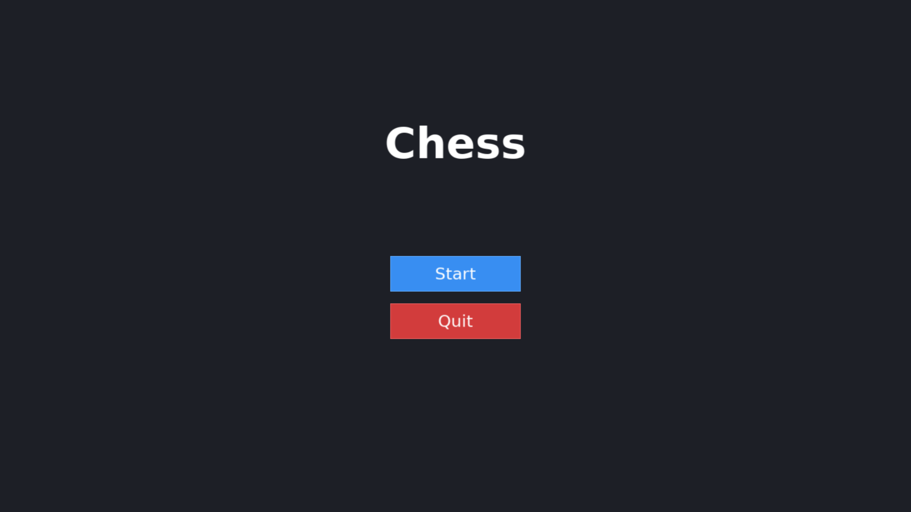
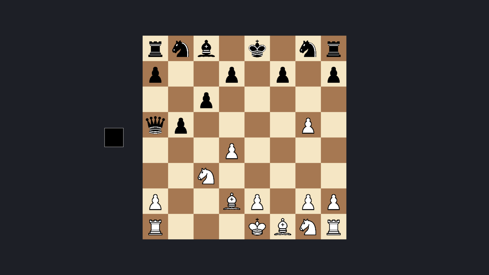

# Chess Game

A two-player chess game built in C++ using SDL3 for rendering and SDL3_ttf for text.
It features a start screen, full piece movement validation, and turn-based play on an 8x8 board.

## Screenshots




## What it does

- Renders an 8x8 chessboard with standard piece placement
- Loads PNG textures for all 12 piece types (6 per color)
- Handles mouse input for selecting and moving pieces
- Enforces turn order between white and black
- Validates legal moves for each piece type

## Dependencies

- [SDL3](https://github.com/libsdl-org/SDL)
- [SDL3_ttf](https://github.com/libsdl-org/SDL_ttf)
- CMake 3.25+
- A C++17 compiler

## Build and run

```bash
make
```

This runs CMake to configure and build the project, then launches the executable.

**Individual steps:**

```bash
make config   # configure with CMake
make build    # compile
make run      # build and run
make clean    # remove build directory
```
